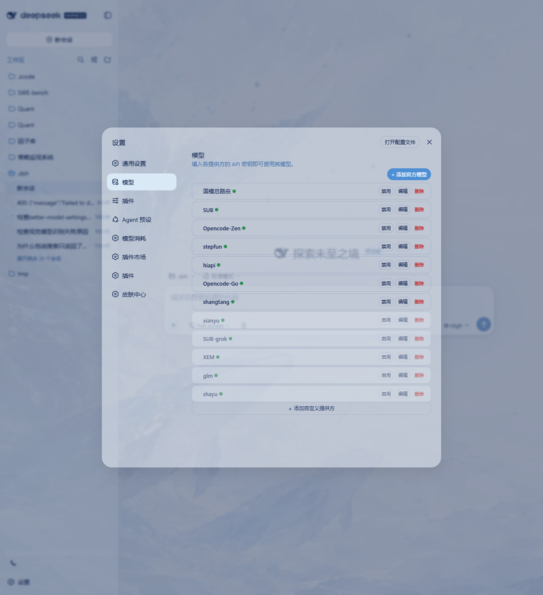
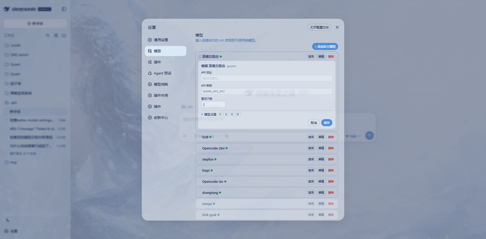
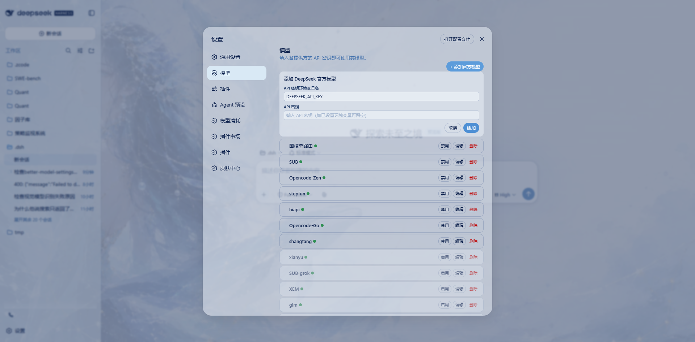
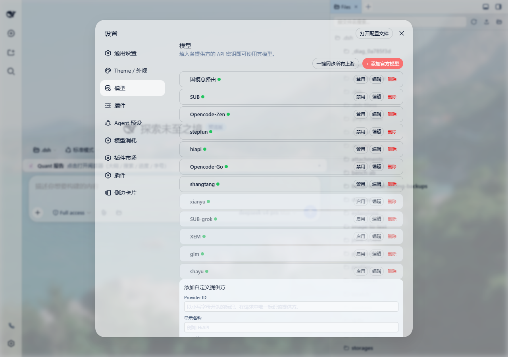
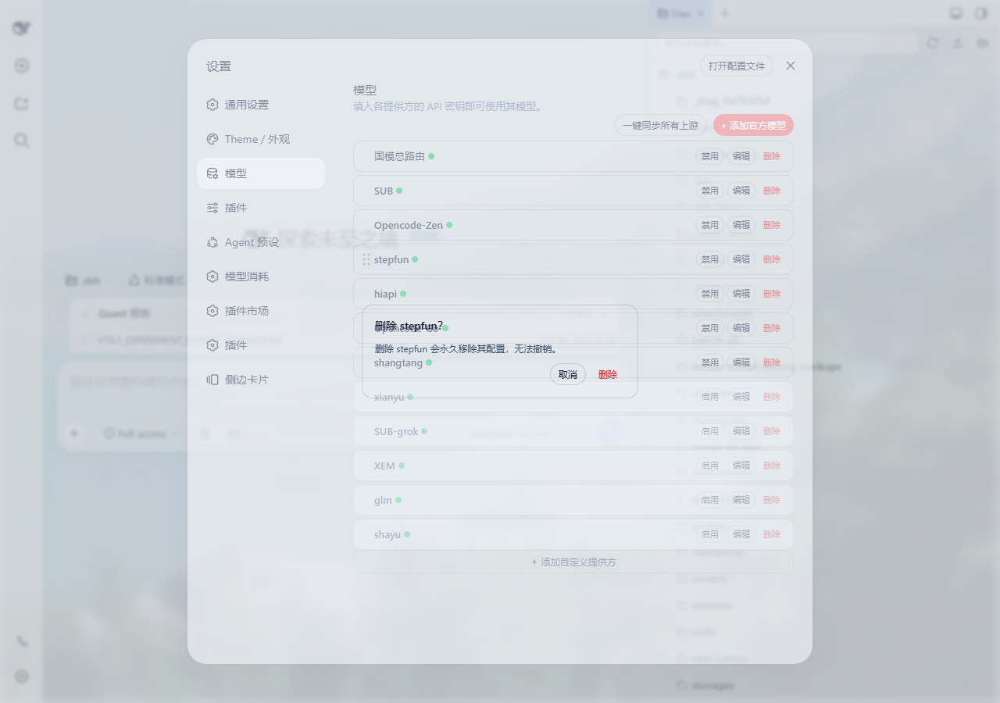

# dsh-better-model-setting

> **⚠️ 警告 / WARNING**  
> 本插件会**替代 DSH 系统设置中的官方"模型"设置页面**（`@deepseek-ai/dsh-client-ui-settings-models`）。  
> This plugin **replaces the official "Models" settings page** (`@deepseek-ai/dsh-client-ui-settings-models`) in the DSH settings UI.
>
> 安装后，设置 → 模型 将不再显示官方页面，而是本插件的功能面板。  
> After installation, Settings → Models will show this plugin's panel instead of the official page.
>
> 如欲恢复官方页面，删除 `profiles/web/cordis.patch.yml` 中以下两行后重启：  
> To restore the official page, remove these two lines from `profiles/web/cordis.patch.yml` and restart:
> ```yaml
> - id: ui-settings-models
>   disabled: true
> ```

---

## 截图 / Screenshots

### 主界面 / Main View


### 编辑器展开 / Editor Expanded


### 添加官方模型 / Add Official Model


### 添加自定义提供方 / Add Custom Provider


### 删除确认 / Delete Confirmation


---

## 中文

### 概述

增强 DSH 模型设置页面的 hybrid 插件，提供 provider 全生命周期管理、每模型思考档位、重试覆盖、凭据可视化等能力，完全替代官方"模型"设置页。

### 功能

| 功能 | 说明 |
|------|------|
| **Provider 管理** | 添加自定义 provider（协议选择 / Base URL / 模型列表）；删除（永久移除配置 + 快照，弹窗确认）；编辑（模型 ID / 显示名称 / 上下文窗口 / 输出 tokens / reasoningEfforts） |
| **启用/禁用** | 禁用 = 快照保存到 JSON DB + 从 `llm-pi-ai.providers` 移除（**可恢复**）；启用 = 从 DB 快照还原完整配置 |
| **官方 DeepSeek** | 默认隐藏；右上角 **"+ 添加官方模型"** 按钮 → 输入 API Key 或环境变量名 → 密钥持久化到凭据库（重启不丢）→ 自动显示官方提供商行 |
| **每模型思考档位** | 白名单（`tiers`）控制前端可见档位；`selected` 指定实际请求时注入的 `reasoningEffort`；服务端白名单校验防止越界值 |
| **每 provider 重试覆盖** | 自定义 `maxRetries` / `mode`（normal / always）/ `retryableCodes` / `backoff`；`always` 模式自动设默认上限 4 次防 token 浪费 |
| **拖拽排序** | 拖拽手柄（hover 显示）→ 实时 auto-squeeze 动画 → `providerOrder` 持久化 |
| **禁用排序** | 禁用后自动排到列表末尾，最早禁用的在最后面（`disabledOrder` 追踪） |
| **统一三按钮** | 每行三个按钮：**禁用/启用**（直接切换，无确认）、**编辑**（打开编辑器，禁用态也可编辑模型设置）、**删除**（红色，弹窗确认后永久删除） |
| **凭据状态** | 绿点 = API Key 已配置；红点 = API Key 缺失；通过 `ctx.credentials.resolve()` 实时读取凭据库 |
| **编辑草稿** | 思考档位 / 重试次数修改只存本地草稿 → 点击"保存"才落盘 → 关闭编辑器如有未保存修改弹窗三选（不保存 / 保存 / 取消） |
| **路由安全** | 自建 loopback HTTP route `GET /api/plugins/better-model-setting` 只读返回状态；POST 写操作需携带 `X-BMS-Token`（进程随机生成，首次 GET 下发） |
| **自动备份** | 每次写 settings.yaml 前自动备份到 `better-model-setting-backups/` 目录，保留最近 5 份，tmp+rename 原子写入 |
| **🆕 同步上游模型（v0.3.0）** | 单 provider 「同步上游」（编辑器内）+ 顶部「一键同步所有上游」；走官方 `ctx.llm.discoverModels('llm-pi-ai', …)` 同款接口（内置 catalog 直接返回目录；自定义 provider 走 baseURL 实际拉取）；弹窗默认**全部未选**（与官方 fetchModels 一致），用户主动勾选要添加的；已存在的 model id 跳过不覆盖保留用户自定义 |
| **🆕 修 ✕-delete-model bug（v0.3.0）** | 之前点 ✕ 只清本地草稿，模型仍然留在 `settings.yaml`；v0.3.0 起客户端跟踪 `deletedModelIds`，提交时由 host 从 `providers[provider].models` 真正移除，并同步清理该 provider 的 `modelEfforts` 残留 |

### 架构

```
Host 侧 (src/index.ts)
├── HTTP route ─ GET(status) / POST(disable|enable|add|apply|addOfficial|delete|discover|addModels)
├── Settings namespace ─ builtinDisabled / providerOrder / modelEfforts / providerRetryOverrides / officialAdded
├── JSON DB ─ disabledProviders 快照存储 + disabledOrder
├── agent/request 拦截 ─ 禁用 provider 守卫 + reasoningEffort 注入 + 白名单校验
├── agent/request-error 拦截 ─ retry policy 覆盖 + finally 还原
├── Credentials 集成 ─ ctx.credentials.resolve() 读取凭据状态
├── handleDiscover ─ 调 ctx.llm.discoverModels('llm-pi-ai', { provider, baseURL, api, apiKey }) 上游拉取
├── handleApply (扩展) ─ providerDeleteModels 真删 + providerAddModels 批量添加（已存在跳过）
└── backup ─ settings.yaml 写前备份（保留 5 份，3s 节流）

Client 侧 (src/client/index.ts)
├── settings.section slot ─ id=models / order=10 / label="模型"
├── Provider 行卡片 ─ 名称 + 凭据圆点 + 三按钮（禁用/启用 + 编辑 + 删除）
├── 编辑器 ─ Base URL / API 密钥 / 重试次数 / 模型目录（<details> 折叠）
│   ├── 模型条目 ─ ID / 显示名称 / 容量（上下文窗口 + 输出 tokens）/ 思考档位芯片
│   ├── 「同步上游」链接 ─ 单 provider discover → 候选弹窗（默认全未选）
│   └── 添加模型按钮（底部，对齐官方布局）
├── 顶部「一键同步所有上游」─ 遍历 syncableProviders 批量 discover → 多 provider 候选弹窗
├── 添加自定义提供方 ─ Provider ID 校验 + 协议选择 + API 地址 + 模型列表
├── 添加官方模型 ─ 表单卡片（环境变量名 + API Key 输入）
├── 删除确认弹窗 ─ 覆盖层 + 对话框（ESC 关闭）
├── 未保存修改弹窗 ─ 三选项（不保存 / 保存 / 取消）
├── deletedModelIds 跟踪 ─ ✕ 删 model 显式入列 → apply 提交给 host 真删
├── 拖拽排序 ─ HTML5 DnD + auto-squeeze 动画
└── API wrapper ─ 过滤内置 provider 隐藏 + 重排 provider 顺序（monkey-patch api.llm / api.sessions）
```

### 依赖

| 依赖 | 说明 |
|------|------|
| `@deepseek-ai/dsh-llm` | `ReasoningEffortId` 类型 |
| `@deepseek-ai/dsh-settings` | settings 命名空间读写 |
| `@deepseek-ai/cordis` | 插件框架 |
| `@deepseek-ai/schemastery` | 配置 schema |
| `@deepseek-ai/dsh-client-ui-slots` | 设置页 slot 注册 |
| `@deepseek-ai/dsh-client-runtime` | client 运行时 |
| `@deepseek-ai/dsh-credentials-local` | 凭据读取 |

### 构建

```bash
# Host: tsc（需 DSH checkout junction 链接）
DSH_CHECKOUT=<checkout> bash scripts/build.sh

# Client: tsdown 打包
npm run build:client
```

### 安装（通过 dsh-super-injector）

```bash
# 在已加载 super-injector 的 DSH 环境中：
dev_inject_plugin <本目录绝对路径>
```

### 替换官方模型页

在 `profiles/web/cordis.patch.yml` 中添加：
```yaml
- id: ui-settings-models
  disabled: true
```

插件自动注册 `settings.section` 的 `id: "models"`、`order: 10`、`label: "模型"`，无缝接管官方位置。

---

## English

### Overview

A DSH hybrid plugin that enhances the Models settings page with full provider lifecycle management, per-model reasoning effort control, retry overrides, and credential visualization. Completely replaces the official "Models" settings page.

### Features

| Feature | Description |
|---------|-------------|
| **Provider Management** | Add custom providers (protocol / Base URL / model list); delete (permanent, with confirmation dialog); edit (model ID / display name / context window / max output tokens / reasoning efforts) |
| **Enable / Disable** | Disable = snapshot to JSON DB + remove from `llm-pi-ai.providers` (**reversible**); Enable = restore full config from snapshot |
| **Official DeepSeek** | Hidden by default; **"+ 添加官方模型"** button at top-right → enter API key or env var name → key persisted to credentials vault (survives restart) → official provider row appears |
| **Per-Model Reasoning Effort** | Whitelist (`tiers`) controls visible effort tiers; `selected` specifies the injected `reasoningEffort` at request time; server-side whitelist validation prevents out-of-range values |
| **Per-Provider Retry Overrides** | Custom `maxRetries` / `mode` (normal / always) / `retryableCodes` / `backoff`; `always` mode auto-defaults to 4 max retries to prevent token waste |
| **Drag Reorder** | Drag handle (visible on hover) live auto-squeeze animation `providerOrder` persisted |
| **Disabled Sorting** | Disabled providers auto-sorted to the bottom of the list; earliest disabled = last (tracked via `disabledOrder`) |
| **Unified Three-Button Row** | **Enable/Disable** (instant toggle, no confirm), **Edit** (open editor, also works in disabled state), **Delete** (red, confirm dialog, permanent removal) |
| **Credential Status** | Green dot = API key configured; Red dot = API key missing; reads from the credentials vault via `ctx.credentials.resolve()` |
| **Edit Draft** | Effort / retry changes kept in local state only "Save" button persists to server closing with unsaved changes shows a 3-choice dialog (Discard / Save / Cancel) |
| **Route Security** | Loopback-only HTTP route `GET /api/plugins/better-model-setting` (read-only status); POST write operations require `X-BMS-Token` header (randomly generated per process, delivered on first GET) |
| **Auto Backup** | `settings.yaml` is backed up before every write to `better-model-setting-backups/` directory (keeps 5 copies, tmp+rename atomic writes, 3s throttle) |
| **🆕 Sync Upstream Models (v0.3.0)** | Per-provider "Sync Upstream" link inside the editor + top-level "Sync All Upstream Models" button; uses the official `ctx.llm.discoverModels('llm-pi-ai', …)` interface (built-in catalog providers return the pi-ai catalog directly; custom providers hit the `baseURL`); picker modal shows candidates **default-unselected** (matching the official `fetchModels` behavior), user opts in to add; already-existing model ids are skipped to preserve user customizations |
| **🆕 Fix ✕-delete-model bug (v0.3.0)** | Previously clicking ✕ only cleared the local draft and the model stayed in `settings.yaml`; v0.3.0 tracks `deletedModelIds` client-side and the host removes them from `providers[provider].models` on save, with a sweep of the `modelEfforts` residue for that provider |

### Architecture

```
Host Side (src/index.ts)
├── HTTP route GET(status) / POST(disable|enable|add|apply|addOfficial|delete)
├── Settings namespace builtinDisabled / providerOrder / modelEfforts / providerRetryOverrides / officialAdded
├── JSON DB disabledProviders snapshot storage + disabledOrder
├── agent/request interceptor disabled provider guard + reasoningEffort injection + whitelist validation
├── agent/request-error interceptor retry policy merge + finally restore
├── Credentials integration ctx.credentials.resolve() for credential status
└── backup settings.yaml pre-write backups (5 copies, 3s throttle)

Client Side (src/client/index.ts)
├── settings.section slot id=models / order=10 / label="模型"
├── Provider cards display name + credential dot + three buttons (enable/disable + edit + delete)
├── Editor Base URL / API Key / retry count / model catalog (<details> collapsible)
│   ├── Model entries ID / display name / capacities (context window + max tokens) / effort tier chips
│   └── Add model button (bottom, aligned with official layout)
├── Add custom provider Provider ID validation + protocol select + API address + model list
├── Add official model form card (env var name + API key input)
├── Delete confirm dialog overlay + dialog (ESC key support)
├── Unsaved changes dialog three options (Discard / Save / Cancel)
├── Drag reorder HTML5 DnD + auto-squeeze animation
└── API wrapper filter hidden built-in providers + reorder provider groups (monkey-patch api.llm / api.sessions)
```

### Dependencies

| Package | Role |
|---------|------|
| `@deepseek-ai/dsh-llm` | `ReasoningEffortId` type |
| `@deepseek-ai/dsh-settings` | Settings namespace R/W |
| `@deepseek-ai/cordis` | Plugin framework |
| `@deepseek-ai/schemastery` | Config schema |
| `@deepseek-ai/dsh-client-ui-slots` | Settings section slot registration |
| `@deepseek-ai/dsh-client-runtime` | Client runtime |
| `@deepseek-ai/dsh-credentials-local` | Credential resolution |

### Build

```bash
# Host: tsc (requires DSH checkout junctions)
DSH_CHECKOUT=<checkout> bash scripts/build.sh

# Client: tsdown bundle
npm run build:client
```

### Install (via dsh-super-injector)

```bash
# In a DSH environment with super-injector loaded:
dev_inject_plugin <absolute-path-to-this-directory>
```

### Replace official Models page

Add to `profiles/web/cordis.patch.yml`:
```yaml
- id: ui-settings-models
  disabled: true
```

The plugin registers `settings.section` with `id: "models"`, `order: 10`, `label: "模型"`, seamlessly taking over the official slot's position.

### License

BSD-3-Clause